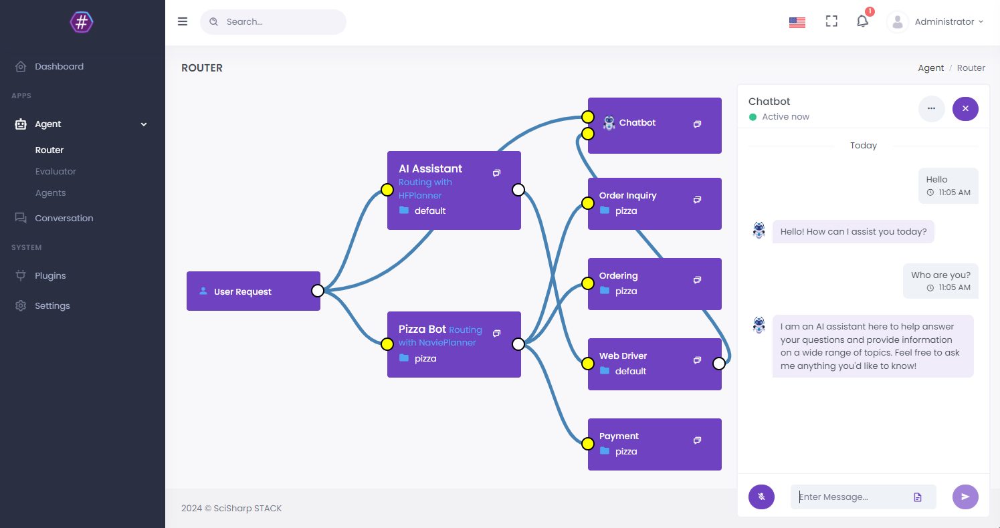

# The Open Source AI Agent Application Framework
## Connect LLMs to your existing application focused on your business

[](https://discord.com/channels/1106946823282761851/1106947212459642991)
[](http://qm.qq.com/cgi-bin/qm/qr?_wv=1027&k=sN9VVMwbWjs5L0ATpizKKxOcZdEPMrp8&authKey=RLDw41bLTrEyEgZZi%2FzT4pYk%2BwmEFgFcrhs8ZbkiVY7a4JFckzJefaYNW6Lk4yPX&noverify=0&group_code=985366726)
[](https://raw.githubusercontent.com/Oceania2018/Miravira/master/LICENSE) 
[](https://www.nuget.org/packages/Miravira.Core) 
[](https://ci.appveyor.com/project/Haiping-Chen/Miravira)
[](https://Miravira.readthedocs.io/en/latest/?badge=latest)

*"Conversation as a platform (CaaP) is the future, so it's perfect that we're already offering the whole toolkits to our .NET developers using the Miravira AI BOT Platform Builder to build a CaaP. It opens up as much learning power as possible for your own robots and precisely control every step of the AI processing pipeline."*
    
**Miravira** is an open source machine learning framework for AI Bot platform builder. This project involves natural language understanding, computer vision and audio processing technologies, and aims to promote the development and application of intelligent robot assistants in information systems. Out-of-the-box machine learning algorithms allow ordinary programmers to develop artificial intelligence applications faster and easier. 

It's written in C# running on .Net Core that is full cross-platform framework, the plug-in and pipeline flow execution design is adopted to completely decouple the plug-ins. C# is a enterprise grade programming language which is widely used to code business logic in information management related system. More friendly to corporate developers. Miravira adopts machine learning algorithm in C# directly. That will facilitate the feature of the typed language C#, and be more easier when refactoring code in system scope. 

**Miravira** is in accordance with components principle strictly, decouples every part that is needed in the platform builder. So you can choose different UI/UX, or pick up a different LLM providers. They are all modulized based on unified interfaces. **Miravira** provides an advanced Agent abstraction layer to efficiently manage complex application scenarios in enterprises, allowing enterprise developers to efficiently integrate AI into business systems.


### Some Features

* Built-in multi-agents and conversation with state management.
* Support multiple LLM Planning approaches to handle different tasks from simple to complex.
* Built-in RAG related interfaces, Memory based vector searching.
* Support multiple AI platforms (ChatGPT 3.5/ 4o/ o1, Gemini 2, LLaMA 3, Claude Sonnet 3.5, HuggingFace).
* Allow multiple agents with different responsibilities cooperate to complete complex tasks. 
* Build, test, evaluate and audit your LLM agent in one place.
* Build-in `Miravira UI` written in [SvelteKit](https://kit.svelte.dev/).
* Abstract standard Rich Content data structure. Integrate with popular message channels like Facebook Messenger, Slack and Telegram.
* Provide RESTful Open API and WebSocket real-time communication.

### Quick Started
1. Run backend service
```sh
 PS D:\> git clone https://github.com/dotnetcore/Miravira
 PS D:\> cd Miravira
 # For Windows
 PS D:\Miravira\> dotnet run --project .\src\WebStarter\WebStarter.csproj -p SolutionName=Miravira
 # For Linux
 $ dotnet run --project ./src/WebStarter/WebStarter.csproj -p SolutionName=Miravira
```

2. Run Admin UI project, reference to [Miravira UI](https://github.com/SciSharp/Miravira-UI).
```sh
PS D:\> git clone https://github.com/SciSharp/Miravira-UI
PS D:\> cd Miravira-UI
PS D:\> npm install
PS D:\> npm run dev
```

Access http://localhost:5015/ 

[Online Demo with UI](https://Miravira.azurewebsites.net/?wt.mc_id=AI-MVP-5005183)



### Core Modules

The core module is mainly composed of abstraction and framework function implementation, combined with some common tools.

- Plugin Loader
- Hooking
- Authentication
- Agent Profile
- Conversation & State
- Routing & Planning
- Templating
- File Repository
- Caching
- Rich Content
- LLM Provider


### Plugins

Miravira uses component design, the kernel is kept to a minimum, and business functions are implemented by external components. The modular design also allows contributors to better participate. Below are the bulit-in plugins:

#### Data Storages
- Miravira.Core.Repository
- Miravira.Plugin.MongoStorage
- Miravira.Plugin.LiteDBStorage
- Miravira.Plugin.TencentCos

#### LLMs
- Miravira.Plugin.Planner
- Miravira.Plugin.AzureOpenAI
- Miravira.Plugin.OpenAI
- Miravira.Plugin.AnthropicAI
- Miravira.Plugin.GoogleAI
- Miravira.Plugin.MetaAI
- Miravira.Plugin.HuggingFace
- Miravira.Plugin.LLamaSharp
- Miravira.Plugin.SemanticKernel
- Miravira.Plugin.SparkDesk

#### Messaging / Channel
- Miravira.OpenAPI
- Miravira.Plugin.ChatHub
- Miravira.Plugin.MetaMessenger
- Miravira.Plugin.Twilio
- Miravira.Plugin.TelegramBots
- Miravira.Plugin.WeChat
  
#### RAGs
- Miravira.Plugin.KnowledgeBase
- Miravira.Plugin.Qdrant

#### Visions
- Miravira.Plugin.PaddleSharp

#### Tools
- Miravira.Plugin.Dashboard
- Miravira.Plugin.RoutingSpeeder
- Miravira.Plugin.AudioHandler
- Miravira.Plugin.EmailHandler
- Miravira.Plugin.FileHandler
- Miravira.Plugin.HttpHandler
- Miravira.Plugin.SqlDriver
- Miravira.Plugin.WebDriver
- Miravira.Plugin.PythonInterpreter

#### UIs
- Miravira.Plugin.ChatbotUI

### Documents

Read the docs: https://Miravira.readthedocs.io?wt.mc_id=AI-MVP-5005183

If you feel that this project is helpful to you, please Star the project, we would be very grateful.

Member project of [SciSharp STACK](https://github.com/SciSharp) which is the .NET based ecosystem of open-source software for mathematics, science, and engineering.
